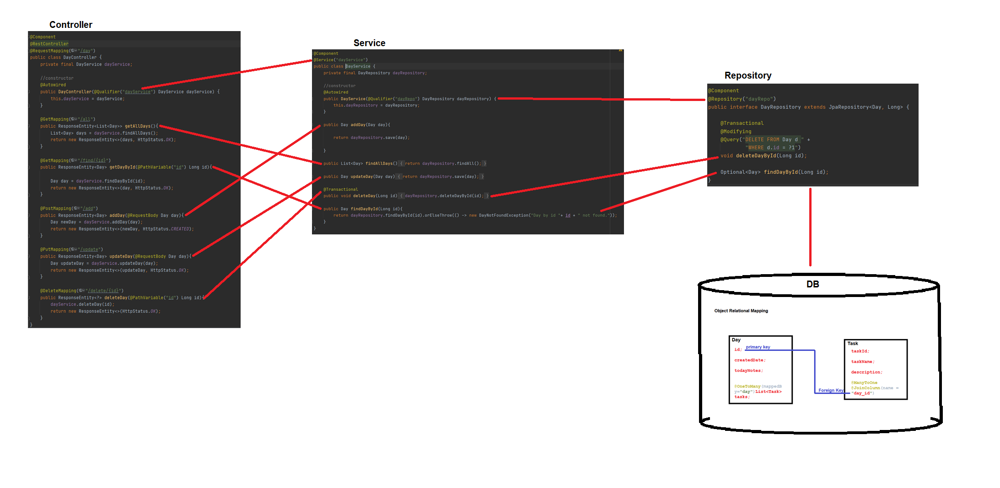

#Daily Journal App  

## Description  
My Personal Side Project of Daily Journal App implementing...  
1. Spring Data JPA  
2. ORM(Object Relational Mapping)  
3. REST API  

##Dependencies Used  
Lombok, Spring Web, Spring Data JPA, PostgreSQL Driver  
  
  
  
##Object-Relational-Mapping  
  
Entity Classes:  
1. Day  
2. Task  

##Repositories  
Extends JpaRepository  
Search, add, delete, update etc Days and Tasks.  
1. DayRepository  
2. TaskRepository  

##Service  
1. DayService  
2. TaskService  
  
##REST Controller  
1. Get All Days: 	http://localhost:8080/day/all  
2. Get Day By Id: 	http://localhost:8080/day/find/{id}  
3. Add Day:			http://localhost:8080/day/add  
4. Update Day:		http://localhost:8080/day/update  
5. Delete Day:		http://localhost:8080/day/delete/{id}  
